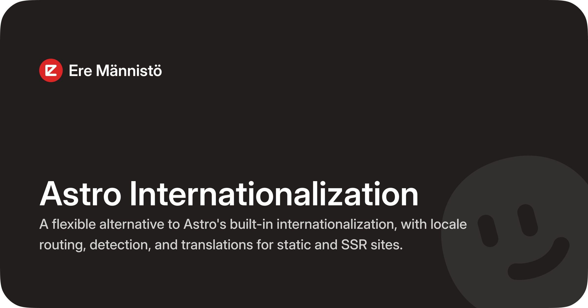

# Astro Internationalization (i18n)




## Installation
```bash
# pnpm
pnpm add @mannisto/astro-i18n

# npm
npm install @mannisto/astro-i18n

# yarn
yarn add @mannisto/astro-i18n
```

## Setup
```typescript
// astro.config.ts
import { defineConfig } from "astro/config"
import i18n from "@mannisto/astro-i18n"

export default defineConfig({
  integrations: [
    i18n({
      defaultLocale: "en",
      locales: [
        { 
          code: "en", 
          name: "English", 
          endonym: "English",
          phrase: "In English"
        },
        { 
          code: "fi", 
          name: "Finnish", 
          endonym: "Suomi", 
          phrase: "Suomeksi" 
        },
      ],
      mode: "server",
      translations: "./src/translations",
    }),
  ],
})
```

## Modes

| | `static` | `server` | `hybrid` |
| --- | --- | --- | --- |
| Pages built at | Build time | Request time | Build time |
| Root redirect | Client-side JS | Server-side | Server-side |
| Remembers locale via | localStorage | Cookie | Cookie |
| Switching locale | ✅ | ✅ | ✅ `Locale.switch()` |
| Redirects bare URLs | ❌ | ✅ | ❌ |
| Needs a server | ❌ | ✅ | ✅ |
| Flash on first visit | ⚠️ | ❌ | ❌ |

## Translations

Create a `src/translations/` directory with a JSON file per locale:
```json
{
  "nav.home": "Home",
  "nav.about": "About",
  "footer.copyright": "All rights reserved"
}
```

All locales must have the same keys as `defaultLocale`.

## Usage
```astro
---
import { Locale } from "@mannisto/astro-i18n/runtime"

export const getStaticPaths = () => {
  return Locale.supported.map((code) => (
    { params: { locale: code } }
  ))
}

const locale = Locale.from(Astro.url)
const t = Locale.use(locale)
---

<html lang={locale}>
  <head>
    <meta charset="UTF-8">
    <title>{t("nav.home")}</title>
  </head>
  <body>
    <h1>{t("nav.home")}</h1>
    <a href={Locale.url("fi", Astro.url.pathname)}>Suomeksi</a>
  </body>
</html>
```

## API

### Locale access
```typescript
Locale.supported         // ["en", "fi"]
Locale.defaultLocale     // "en"
Locale.from(Astro.url)   // "fi" — derives locale from current URL
Locale.get()             // all locale configs
Locale.get("fi")         // { code: "fi", name: "Finnish", ... }
```

### Translations
```typescript
const t = Locale.use(locale)
t("nav.home")            // "Home"
```

### URL helpers
```typescript
Locale.url("fi")                     // "/fi/"
Locale.url("fi", "/about")           // "/fi/about"
Locale.url("fi", Astro.url.pathname) // "/fi/current-path"
```

### Language switcher
```astro
---
import { Locale } from "@mannisto/astro-i18n/runtime"
import type { LocaleConfig } from "@mannisto/astro-i18n"

const locales = Locale.get() as LocaleConfig[]
---

{locales.map((locale) => (
  <button data-locale={locale.code}>
    {locale.phrase ?? locale.endonym}
  </button>
))}

<script>
  import { Locale } from "@mannisto/astro-i18n/runtime"

  document.querySelectorAll("button[data-locale]").forEach((button) => {
    button.addEventListener("click", () => {
      const locale = button.getAttribute("data-locale")
      if (locale) Locale.switch(locale)
    })
  })
</script>
```

`Locale.switch(locale, path?)` updates the cookie then navigates. Works in all modes.

### Middleware (server mode)

Auto-registered in `server` mode. Redirects unprefixed URLs and keeps the cookie in sync. Can also be used manually:
```typescript
// src/middleware.ts
import { sequence } from "astro/middleware"
import { onRequest as i18nMiddleware } from "@mannisto/astro-i18n/middleware"
import { onRequest as myMiddleware } from "./my-middleware"

export const onRequest = sequence(i18nMiddleware, myMiddleware)
```

## Configuration
```typescript
i18n({
  // Required — list of supported locales
  locales: [
    {
      code: "en",           // used in URLs: /en/about
      name: "English",      // name in English
      endonym: "English",   // name in its own language
      phrase: "In English", // optional, for locale switchers
    },
  ],

  // Detection and rendering mode — default: "static"
  mode: "static" | "server" | "hybrid",

  // Locale to use when no preference is stored — default: first locale
  defaultLocale: "en",

  // Paths to bypass the middleware — server mode only
  ignore: ["/keystatic", "/api"],

  // Path to translation files — omit to disable translations
  translations: "./src/translations",
})
```

## Development
```bash
pnpm install
pnpm playwright install chromium
pnpm test:unit
pnpm test:e2e
```

## License

MIT © [Ere Männistö](https://github.com/eremannisto)