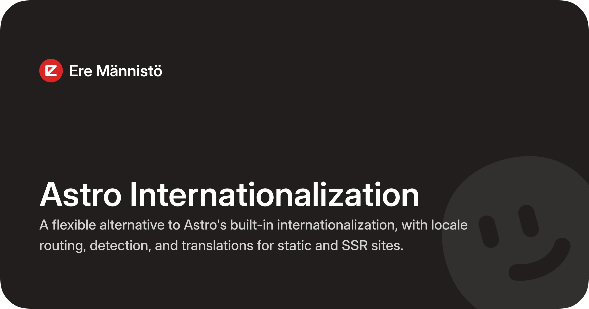

# Astro Internationalization




A flexible alternative to Astro's built-in internationalization, with locale routing, detection, and translations for static and SSR sites.

## Installation

```bash
npm install @mannisto/astro-i18n
```

```bash
pnpm add @mannisto/astro-i18n
```


```bash
yarn add @mannisto/astro-i18n
```

## Configuration

Add the integration to your `astro.config.ts`.

```typescript
// astro.config.ts
import { defineConfig } from "astro/config"
import i18n from "@mannisto/astro-i18n"

export default defineConfig({
  integrations: [
    i18n({
      locales: [
        {
          code: "en",           // Used in URLs: /en/about
          name: "English",      // Display name in English (optional)
          endonym: "English",   // Display name in its own language (optional)
          phrase: "In English", // For locale switchers (optional)
          direction: "ltr",     // Defaults to "ltr" (optional)
        },
        {
          code: "fi",
          name: "Finnish",
          endonym: "Suomi",
          phrase: "Suomeksi",
        },
      ],

      // Defaults to the first locale in the list
      defaultLocale: "en",

      // Path to translation JSON files. Omit to disable translations.
      translations: "./src/translations",

      // URL paths that bypass the middleware. Requires a server adapter.
      // Glob patterns supported.
      ignore: ["/keystatic", "/api/uploads/**/*.png"],
    }),
  ],
})
```

## File structure

Pages are organized under a `[locale]` folder, and each page is served at a URL prefixed with the locale code, for example `/en/about` or `/fi/about`.

```
src/
├── pages/
│   ├── [locale]/
│   │   ├── index.astro
│   │   └── about.astro
│   └── 404.astro
└── translations/
    ├── en.json
    └── fi.json
```

> ⚠ Do not create `src/pages/index.astro`. The integration injects its own root route for locale detection, and a conflicting file will cause a build error.

## Rendering modes

Your Astro `output` and `adapter` choice map to three rendering modes:

| Mode     | Output             | Adapter | Behaviour     |
|----------|--------------------|:-------:|---------------|
| `Static` | `output: "static"` | No      | Fully static  |
| `Hybrid` | `output: "static"` | Yes     | Mostly static |
| `Server` | `output: "server"` | N/A     | Fully server  |

## Locale pages

How you write locale pages depends on your rendering mode.

### Static & Hybrid

Use `getStaticPaths` to generate a page for each locale at build time.

```astro
---
// src/pages/[locale]/index.astro
import { Locale } from "@mannisto/astro-i18n/runtime"

export const getStaticPaths = () => {
  return Locale.supported.map((code) => {
    return {
      params: {
        locale: code,
      },
    }
  })
}

const { code, t } = Locale.use(Astro)
---

<html lang={code}>
  <body>
    <h1>{t("nav.home")}</h1>
  </body>
</html>
```

### Server

Skip `getStaticPaths` and mark pages as not prerendered.

```astro
---
// src/pages/[locale]/index.astro
export const prerender = false

import { Locale } from "@mannisto/astro-i18n/runtime"

const { code, t } = Locale.use(Astro)
---

<html lang={code}>
  <body>
    <h1>{t("nav.home")}</h1>
  </body>
</html>
```

## The 404 page

The 404 page handles visitors who land on an unprefixed URL like `/about`. What you need depends on your setup.

### Static

The browser handles the redirect. Add `<LocaleRedirect>` to `<head>`.

```astro
---
// src/pages/404.astro
import { LocaleRedirect } from "@mannisto/astro-i18n/components"
import { Locale } from "@mannisto/astro-i18n/runtime"

const { code } = Locale.use(Astro)
---

<html lang={code}>
  <head>
    <LocaleRedirect />
    <title>404</title>
  </head>
  <body>
    <h1>404</h1>
  </body>
</html>
```

### Hybrid

The server handles the redirect. Call `response()` and return it if present.

```astro
---
// src/pages/404.astro
export const prerender = false

import { Locale } from "@mannisto/astro-i18n/runtime"

const { code, response } = Locale.use(Astro)
const redirect = response()
if (redirect) return redirect
---

<html lang={code}>
  <head>
    <title>404</title>
  </head>
  <body>
    <h1>404</h1>
  </body>
</html>
```

### Server

The middleware redirects unprefixed paths before they reach the 404 page. No extra handling needed.

```astro
---
// src/pages/404.astro
export const prerender = false

import { Locale } from "@mannisto/astro-i18n/runtime"

const { code } = Locale.use(Astro)
---

<html lang={code}>
  <head>
    <title>404</title>
  </head>
  <body>
    <h1>404</h1>
  </body>
</html>
```

## Layout

Each locale page needs `<LocaleCookie>` in the `<head>` to persist the current locale to a cookie. A shared layout is a convenient place for it, but it can be added to each page directly as well.

`<LocaleHreflang>` renders `<link rel="alternate">` tags for all supported locales. Optional but recommended for SEO.

```astro
---
// src/layouts/Layout.astro
import { Locale } from "@mannisto/astro-i18n/runtime"
import { LocaleCookie, LocaleHreflang } from "@mannisto/astro-i18n/components"

const { code } = Locale.use(Astro)
const site = Astro.site ?? Astro.url.origin
---

<html lang={code}>
  <head>
    <meta charset="UTF-8" />
    <LocaleCookie locale={code} />
    <LocaleHreflang url={Astro.url} site={site} />
  </head>
  <body>
    <slot />
  </body>
</html>
```

## Translations

Create one JSON file per locale in the configured `translations` directory. Keys must be flat strings — no nesting.

```json
{
  "nav.home": "Home",
  "nav.about": "About",
  "footer.copyright": "All rights reserved"
}
```

Use `t` from `Locale.use(Astro)` to look up a key for the current locale. A warning is logged at startup for any keys present in the default locale but missing in another.

```astro
---
import { Locale } from "@mannisto/astro-i18n/runtime"

const { t } = Locale.use(Astro)
---

<h1>{t("nav.home")}</h1>
```

For non-Astro components such as React or Vue, destructure `t` from `Locale.use(Astro)` in the parent page and pass it as a prop.

## Language switcher

No switcher component is included, but `Locale.get()` and `Locale.switch()` give you everything needed to build one.

```astro
---
import { Locale } from "@mannisto/astro-i18n/runtime"

const locales = Locale.get()
---

{locales.map((locale) => (
  <button data-locale={locale.code}>
    {locale.phrase ?? locale.endonym ?? locale.code}
  </button>
))}

<script>
  import { Locale } from "@mannisto/astro-i18n/runtime"

  document.querySelectorAll("button[data-locale]").forEach((btn) => {
    btn.addEventListener("click", () => {
      const code = btn.getAttribute("data-locale")
      if (code) Locale.switch(code)
    })
  })
</script>
```

## Advanced

### Middleware composition

When a server adapter is configured, the integration middleware runs automatically before your own. Any middleware you define in `src/middleware.ts` will run after it with no additional setup.

### Ignoring paths

Paths can be excluded from middleware processing with the `ignore` option. Plain paths match the path and all sub-paths. Glob patterns are also supported.

```typescript
i18n({
  ignore: ["/keystatic", "/api/uploads/**/*.png"],
})
```

## Components

### `LocaleCookie`

Writes the current locale to a cookie on page load. Place in `<head>` on every locale page through your layout.

```astro
import { LocaleCookie } from "@mannisto/astro-i18n/components"

<LocaleCookie locale={code} />
```

| Prop | Type | Default | Description |
|---|---|---|---|
| `locale` | `string` | — | Current locale code |
| `age` | `number` | `31536000` | Cookie max-age in seconds (1 year) |

### `LocaleHreflang`

Renders `<link rel="alternate">` hreflang tags for all supported locales plus `x-default`. Place in `<head>` through your layout.

```astro
import { LocaleHreflang } from "@mannisto/astro-i18n/components"

<LocaleHreflang url={Astro.url} site={Astro.site ?? Astro.url.origin} />
```

| Prop | Type | Description |
|---|---|---|
| `url` | `URL` | Current page URL |
| `site` | `URL \| string` | Base site URL |

### `LocaleRedirect`

A client-side script that reads the locale cookie and redirects the browser to the correct locale-prefixed path. Use in `404.astro` in `Static` mode only.

```astro
import { LocaleRedirect } from "@mannisto/astro-i18n/components"

<LocaleRedirect />
```

## API reference

### `Locale.use(Astro)`

The primary way to access locale data in a page or layout. Returns a request-scoped instance — all members are safe to destructure.

```astro
const { code, name, endonym, phrase, direction, t, response } = Locale.use(Astro)
```

| Member | Type | Description |
|---|---|---|
| `code` | `string` | Current locale code derived from the URL |
| `name` | `string \| undefined` | Display name in English |
| `endonym` | `string \| undefined` | Display name in its own language |
| `phrase` | `string \| undefined` | Short phrase for locale switchers |
| `direction` | `"ltr" \| "rtl"` | Text direction, defaults to `"ltr"` |
| `t(key)` | `string` | Looks up a translation key for the current locale |
| `response()` | `Response \| null` | Returns a redirect if the URL has no locale prefix, otherwise `null` |

### Other methods

| Method | Returns | Description |
|---|---|---|
| `Locale.supported` | `string[]` | All configured locale codes |
| `Locale.defaultLocale` | `string` | The configured default locale code |
| `Locale.get()` | `LocaleConfig[]` | All locale configs |
| `Locale.get("fi")` | `LocaleConfig` | Config for a specific locale |
| `Locale.fromURL(url)` | `string` | Derives the locale code from a URL |
| `Locale.url("fi", "/about")` | `string` | Builds a locale-prefixed URL path |
| `Locale.switch("fi")` | `void` | Sets the locale cookie and navigates (browser only) |
| `Locale.hreflang(url, site)` | `{ href, hreflang }[]` | Hreflang entries for all locales plus `x-default` |

---

## Migrating from v1

### Remove `mode` from config

The `mode` option has been removed. The integration now selects the correct behaviour automatically based on your adapter and output combination.

```diff
i18n({
  locales: [...],
- mode: "server",
})
```

### Replace per-request helpers with `Locale.use()`

The standalone helper methods have been consolidated into a single `Locale.use(Astro)` call.

```diff
- const locale = Locale.from(Astro.url)
- const t = Locale.t(Astro.url)
- const direction = Locale.direction(Astro.url)
- const response = Locale.response(Astro)
+ const { code, t, direction, response } = Locale.use(Astro)
```

## License

MIT © [Ere Männistö](https://github.com/eremannisto)
