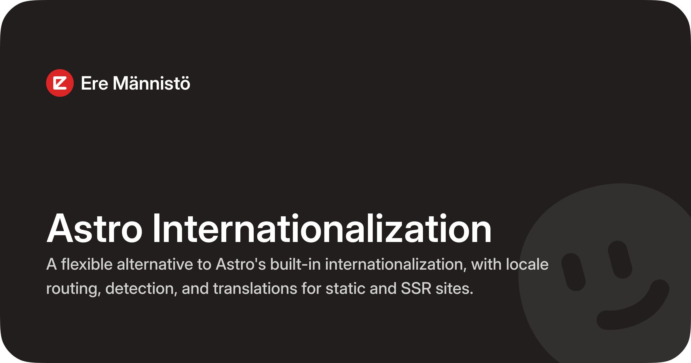

# Astro Internationalization




Locale routing, locale detection and translations for Astro. An alternative to Astro's built-in i18n for static, hybrid and server sites.

- [Install](#install)
- [Configuration](#configuration)
- [Pages](#pages)
- [Layout](#layout)
- [404 page](#404-page)
- [Translations](#translations)
- [Language switcher](#language-switcher)
- [API](#api)
- [Good to know](#good-to-know)
- [Migrate from v2](#migrate-from-v2)
- [Contributing](#contributing)
- [License](#license)

## Install

```bash
npm install @mannisto/astro-i18n
```

The integration requires Astro 6.4.6 or later, or Astro 7. Astro 7.2.8 or later has all known security fixes.

## Configuration

```typescript
// astro.config.ts
import i18n from "@mannisto/astro-i18n"
import { defineConfig } from "astro/config"

export default defineConfig({
  integrations: [
    i18n({
      locales: [
        { code: "en", name: "English", endonym: "English" },
        { code: "fi", name: "Finnish", endonym: "Suomi", phrase: "Suomeksi" },
      ],
      defaultLocale: "en",
      prefixDefaultLocale: false,
      translations: "./src/translations",
    }),
  ],
})
```

| Option | Default | Description |
|---|---|---|
| `locales` | — | The supported locales. Each locale has a `code` and an optional `name`, `endonym`, `phrase` and `direction` (`"ltr"` or `"rtl"`). |
| `defaultLocale` | First locale | The locale for visitors with no stored preference. |
| `prefixDefaultLocale` | `false` | `false`: the default locale uses `/about`, and `/en/about` gives a 404. `true`: it uses `/en/about`. The other locales always have a prefix. The default is the same as in Astro's built-in i18n. |
| `translations` | — | The folder with one JSON file for each locale. Omit it to disable translations. |

## Pages

Put the locale pages in a `[locale]` folder. Pages outside this folder, for example `privacy.astro`, have no locale prefix.

```
src/pages/
├── [locale]/
│   ├── index.astro
│   └── about.astro
├── 404.astro
└── privacy.astro
```

```astro
---
// src/pages/[locale]/index.astro
import { Locale } from "@mannisto/astro-i18n/runtime"

// Static and hybrid sites only. Server pages do not need this.
export const getStaticPaths = () => {
  return Locale.supported.map((code) => {
    return {
      params: {
        locale: code,
      },
    }
  })
}

const { code, t } = Locale.use(Astro)
---

<html lang={code}>
  <body>
    <h1>{t("nav.home")}</h1>
  </body>
</html>
```

## Layout

Add `<LocaleCookie>` to each locale page. It stores the current locale, so the next visit to `/` goes to the same locale. `<LocaleHreflang>` adds the hreflang links for search engines.

```astro
---
// src/layouts/Layout.astro
import { LocaleCookie, LocaleHreflang } from "@mannisto/astro-i18n/components"
import { Locale } from "@mannisto/astro-i18n/runtime"

const { code } = Locale.use(Astro)
---

<html lang={code}>
  <head>
    <LocaleCookie locale={code} />
    <LocaleHreflang url={Astro.url} site={Astro.site ?? Astro.url.origin} />
  </head>
  <body>
    <slot />
  </body>
</html>
```

## 404 page

All locales use one `src/pages/404.astro`.

```astro
---
// src/pages/404.astro
import { LocaleRedirect } from "@mannisto/astro-i18n/components"
---

<html>
  <head>
    <LocaleRedirect />
  </head>
  <body>
    <h1>404</h1>
  </body>
</html>
```

`<LocaleRedirect>` is necessary only for static sites with `prefixDefaultLocale: true`. There, it redirects a URL without a locale prefix in the browser. In all other setups, it does nothing.

## Translations

Add one JSON file for each locale to the `translations` folder. Use flat keys.

```json
{
  "nav.home": "Home",
  "nav.about": "About",
  "greeting": "Hello {{user}}"
}
```

Use `t` from `Locale.use(Astro)` to get the text for the current locale. Give values for the `{{name}}` placeholders in the second argument.

```astro
---
import { Locale } from "@mannisto/astro-i18n/runtime"

const { t } = Locale.use(Astro)
---

<!-- Hello World -->
<h1>{t("greeting", { user: "World" })}</h1>
```

If a key is missing, `t` returns the key name and logs an error. If a placeholder has no value, it stays in the text and `t` logs an error. At startup, the integration shows a warning for each key that a locale does not have.

For React, Vue and other frameworks, pass the translated text as a prop. `t` works only on the server.

> ⚠ `t` does not escape the values. Astro escapes text in templates, but not with `set:html`. Do not use `set:html` with values from visitors.

## Language switcher

Use `Locale.get()` and `Locale.switch()` to make a language switcher.

```astro
---
import { Locale } from "@mannisto/astro-i18n/runtime"
---

{Locale.get().map((locale) => (
  <button data-locale={locale.code}>{locale.phrase ?? locale.endonym ?? locale.code}</button>
))}

<script>
  import { Locale } from "@mannisto/astro-i18n/runtime"

  for (const button of document.querySelectorAll("button[data-locale]")) {
    button.addEventListener("click", () => {
      const code = button.getAttribute("data-locale")
      if (code) Locale.switch(code)
    })
  }
</script>
```

## API

`Locale.use(Astro)` returns the current locale: `{ code, name, endonym, phrase, direction, t }`.

| Method | Returns | Description |
|---|---|---|
| `Locale.supported` | `string[]` | All locale codes |
| `Locale.defaultLocale` | `string` | The default locale code |
| `Locale.get()` | `LocaleConfig[]` | All locale configs |
| `Locale.get("fi")` | `LocaleConfig` | The config of one locale |
| `Locale.fromURL(url)` | `string` | The locale code of a URL |
| `Locale.url("fi", "/about")` | `string` | The URL path of a page in a locale |
| `Locale.switch("fi")` | `void` | Stores the locale and opens the page in that locale (browser only) |
| `Locale.hreflang(url, site)` | `{ href, hreflang }[]` | The hreflang links for all locales and `x-default` |

| Component | Props |
|---|---|
| `<LocaleCookie>` | `locale`, `age` (seconds, default 1 year) |
| `<LocaleHreflang>` | `url`, `site` |
| `<LocaleRedirect>` | — |

Import the types from the package, for example `import type { LocaleConfig } from "@mannisto/astro-i18n"`.

## Good to know

- **Locale detection.** With `prefixDefaultLocale: true`, a URL without a locale prefix redirects to the locale that the visitor used last. A new visitor goes to the default locale.
- **Custom root page.** With `prefixDefaultLocale: true`, add `src/pages/index.astro` to show your own page at `/`, for example a language selector. With `false`, this file is not allowed, because `/` is the default locale home page.
- **Links.** Use `Locale.url()` to make links. With `prefixDefaultLocale: false`, `Astro.url` still contains the default locale prefix.
- **Sitemap without a prefix.** With `prefixDefaultLocale: false`, `@astrojs/sitemap` lists the default locale pages with their prefix. Remove the prefix with the `serialize` option. For example, with `en` as the default locale:

  ```typescript
  sitemap({
    serialize(item) {
      item.url = item.url.replace("/en/", "/")
      return item
    },
  })
  ```

- **Middleware order.** The integration middleware runs before your own `src/middleware.ts`.
- **Dev and build.** Dev and the build give the same URLs, in static, hybrid and server mode.

## Migrate from v2

Version 3 has four breaking changes.

### Keep the v2 URLs

The default locale has no URL prefix by default: `/about` in place of `/en/about`. To keep the v2 URLs, set `prefixDefaultLocale` to `true`.

```diff
i18n({
  locales: [...],
+ prefixDefaultLocale: true,
})
```

### Remove the `response()` call from the 404 page

The middleware now does the redirects. The 404 page does not need `response()` or `prerender = false`.

```diff
---
- export const prerender = false
-
import { Locale } from "@mannisto/astro-i18n/runtime"

- const { code, response } = Locale.use(Astro)
- const redirect = response()
- if (redirect) return redirect
+ const { code } = Locale.use(Astro)
---
```

### Remove the `ignore` option

The middleware now skips all pages outside the `[locale]` folder, for example API routes. Remove `ignore` from your config.

```diff
i18n({
  locales: [...],
- ignore: ["/api"],
})
```

### Update Astro

The integration requires Astro 6.4.6 or later, or Astro 7.

## Contributing

Read [CONTRIBUTING.md](./CONTRIBUTING.md) for the setup and the test commands. Report bugs and ideas in [GitHub issues](https://github.com/eremannisto/astro-i18n/issues).

## License

MIT © [Ere Männistö](https://github.com/eremannisto)
